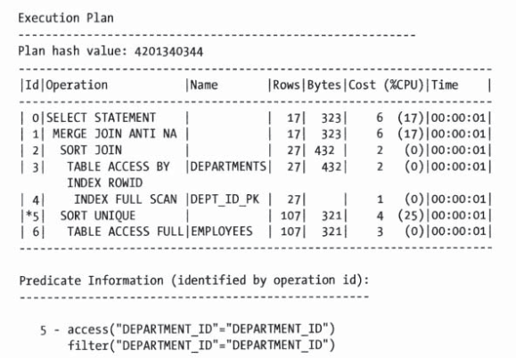

---
layout:
  title:
    visible: false
  description:
    visible: false
  tableOfContents:
    visible: true
  outline:
    visible: true
  pagination:
    visible: true
---

# 半联结和反联结

半联结和反联结是Oracle优化器能够选择用来在获取信息时应用的两个密切相关的联结方法(实际上是联结方法的选项)。SQL语言是用来指定用户所希望获取到的数据集的，它将实际上如何定位到这些数据的问题留给数据库去做。因此，没有一种SQL语法能够明确地调用某个特定的联结方法。当然，Oracle确实提供了可通过提示来指导优化器的能力。本章将讨论这两个联结优化选项、激活它们的SQL语法、使用它们所必须具备的条件以及限制条件，最后，还包括一些何时以及如何来使用它们的指南。

一定要认识到Oracle不断在改进优化器的代码,以及并非它的所有行为细节都有相应的文档。所有例子都是基于Oracle 11gR2(11.2.0.1)版本来建立的。我的11g版本现在具有2399个参数，很多都影响着优化器的行为方式。在适当的地方，我会提到对所讨论的问题具有直接指导意义的参数设置。但是，你需要在自己的系统上来验证这些行为。

## 半联结

半联结是在两个数据集(表)之间的联结，其中第一个数据集中的数据行在决定是否返回时会根据在另一个数据集中出现或不出现至少一个相匹配的数据行来确定。在后面再回过头来说“不出现”匹配行—这是半联结的一种特殊情形，称为反联结。如果回忆一下小学数学，你就能想象到这个运算如下图中的典型的集合理论图。

<figure><figcaption><p>半联结图解</p></figcaption></figure>

半联结的一个基本思想，但是对于描述它的具体细节还是不够详细的。这种类型的图称为维恩图。这种特殊的维恩图通常被用来描述本质上就是交集的内联结。不过，没有一种便捷的方法能够用维恩图来完全描述半联结。标准的内联结与半联结之间最主要的区别在于在半联结中,第1个数据集中的每一条记录(图中的查询1)只返回一次,而不管在第2个数据集(图中的查询2)中有几条匹配数据。这个定义表明这个查询的实际处理过程可以通过在找到第1个匹配以后马上停止第2个查询来进行优化。从本质上来说，这就是半联结:可以通过在查询2执行完成之前停止处理该查询来进行优化。这种联结技术在Oracle基于成本的优化器中当查询中又包含在`IN`或`EXISTS`子句中`(或者包含在很少使用的与IN同义的=ANY子句中)`的子查询时是一种可选方案。其语法看上去是很熟悉的。下列代码清单分别给出了使用IN和EXISTS的两个最常见的半联结查询形式的例子。

> IN半联接例子


```sql
select /* using in */
	department_name
from hr.departments dept
where department_id in (select department_id from hr.employees emp);
```


> EXISTS


```sql
select /* using exists */
	department_name
from hr.departments dept
where exists (
	select null from hr.employees emp 
	where emp.department_id = dept.deparment_id
);
```


这两个查询在功能上是等价的。也就是说如果输入相同，它们总是返回同样的数据集。与之紧密相关的还有几个其他的形式。下列代码清单给出了几个密切相关的其他语法的例子。

> EXISTS和IN的可替换语法—INNER JOIN


```sql
select /* inner join */
	department_name
from hr.departments dept,hr.employees emp
where emp.department_id = dept.deparment_id
```


显然内联结在功能上与半联结并不是等价的，因为返回的行数不同。你可能还会注意到有很多重复值。试着用DISTINCT来去除重复。

> EXISTS和IN的可替换语法—具有DISTINCT的INNER JOIN


```sql
select /* distinct inner join */
	distinct department_name
from hr.departments dept,hr.employees emp
where emp.department_id = dept.deparment_id
```


具有DISTINCT的内联结看上去是很不错的。在这个例子中，它实际上与半联结返回了同样的记录集。正如前面所提到过的，INTERSECT集合运算与半联结是非常相近的。

> EXISTS和IN的可替换语法—丑陋的交集


```sql
select /* ugly intersect */
	department_name
from hr.departments dept,(
	select department_id from hr.departments
	intersect
	select department_id from hr.employees
) b
where b.department_id = dept.department_id;
```


虽然使用Intersect看上去也是不错的，但是语法很复杂。试下在子查询中使用有些晦涩难懂的=ANY关键字。

> EXISTS和IN的可替换语法—=ANY子查询


```sql
select /* any subquery */
	department_name
from hr.departments dept
where department_id = ANY(select department_id from hr.employees emp);
```


> 子查询需要和外层有联系


```sql
--返回全部数据
select department_id from hr.departments dept
where exists (select null from dual);

--一条都不返回
select department_id from hr.departments dept
where exists (select 'anything' from dual where 1=2);
```


## 半联结执行计划

在简介部分我提到过半联结本身实际上并不是一种联结方法,而更像是其他联结方法的一个选项。Oracle中最常用的3种联结方法是`嵌套循环、散列联结和合并联结`。每种联结方法都可以应用`半联结`选项。同时还要记住允许处理过程在子查询中找到第1条匹配记录的时候停止是一种优化方法。让我们使用一小段伪码更全面地来描述处理过程。外层查询为Q1，内层查询(子查询)为Q2。你在下列代码清单中看到的是一个嵌套循环半联结的基本处理过程。

> 嵌套循环半联结伪码

<figure><figcaption><p>嵌套循环半联结伪码</p></figcaption></figure>

半联结所提供的优化在于，当找到一条匹配记录时使得代码跳出内层循环的`IF`语句。显然对于大数据集，与对外层查询中的每行数据都必须循环读取内层查询返回的所有记录的普通嵌套循环联结相比，这个技术可以节省大量的时间。此时你可能会想这一技术在嵌套循环联结中会比在其他两种联结方法中能节省更多的时间。你是对的，因为其他两种联结方法必须在将内层查询的所有记录都取回以后才能开始检查匹配。因此一般来说嵌套循环联结可以从半联结技术中得到最大的益处。记住优化器选择联结方法仍然是基于它的包括各种不同半联结选项的成本算法。&#x20;

现在让我们再次运行IN和EXISTS的查询，并查看优化器所生成的执行计划。

> 半联结执行计划

<figure><figcaption><p>半联结执行计划</p></figcaption></figure>

同时给出了自动追踪的统计信息，因此你可以看到这两个语句的确是用同样的方法来处理的。执行计划是一致的，统计信息也是一致的。说明这一点是为了消除长期以来人们认为的使用`EXISTS查询`与使用`IN查询`的处理方法很不相同这种观点。在过去(8i版本)可能确实有这个问题，但在很多年前这个问题就解决了。事实是优化器能够并且确实将这两种形式的查询转换成了同样的语句。

注意有一种方法可以更好地了解在解析语句的时候优化器所采用的决策过程。你可以使用下面的命令来让优化器在一个追踪文件中记录它的操作。&#x20;

`alter session set events '10053 trace name context forever, level 1';`

设定这个事件将会在硬解析时在`USER_DUMP_DEST`文件夹中建立一个追踪文件。我将其称为`“Wolfganging”`因为`Wolfgang Breiting`是第一个真正分析这个10053追踪文件的内容并发表研究成果的人。仔细查看每个语句的10053记录数据可以确定，在优化器确定执行计划之前这两个语句被转化为了同样的语句。

> IN版本语句的10053追踪文件摘录

<figure><figcaption><p>IN版本语句的10053追踪文件摘录</p></figcaption></figure>

> EXIST版本语句的10053追踪文件摘录

<figure><figcaption><p>EXIST版本语句的10053追踪文件摘录</p></figcaption></figure>

你可以从追踪文件摘录中看到，两个查询都进行了子查询去嵌套，并且它们都转化成了同样的语句(也就是说,两个版本中的`“转化后的最终査询”`部分是完全一样的)。顺便说一下,Oracle数据库10gR2版本中也是这样的。

## 控制半联结执行计划

现在让我们来看一些控制执行计划的方法,优化器需要一点点帮助。有两种机理可供你选择。一种机理是你可以应用一系列提示到单个的查询。另一种机理是影响所有查询的实例级参数。

### 使用提示控制

有好几个提示可以用来鼓励或限制半联结。自11gR2起，可以使用下面这些提示。&#x20;

* SEMIJOIN--进行半联结(优化器选择使用哪种类型)
* NO\_SEMIJOIN--显然地意味着不进行半联结
* NL\_SJ--进行嵌套循环半联结(自10g起被弃用)
* HASH\_SJ--进行散列半联结(自10g起被弃用)
* MERGE\_SJ--进行合并半联结(自10g起被弃用)

更明确的提示(`NLSJ、HASHSJ`及`MERGESJ`)从10g开始被弃用了。尽管即使在11gR2中它们也可以像以前一样继续使用，请注意文档中说它们可能在某些时候不好用。所有这些半联结提示都需要在子查询而不是外层查询中进行声明。下列代码清单给出了一个使用`NO_SEMIJOIN`提示的例子。

> 使用NO\_SEMIJOIN提示的EXISTS语句


```sql
select /* exists no_semijoin */ department_name
from hr.deparments dept
where exists (
	select /*+ no_semijoin */ null from hr.employees emp
	where emp.department_id = dept.department_id
);
```


<figure><figcaption><p>使用NO_SEMIJOIN提示的EXISTS语句</p></figcaption></figure>

在这个例子中，使用`NO_SEMIJ0IN`提示关闭了优化器使用半联结的能力。如所期望的那样，查询不再进行半联结，而是使用`FILTER`运算来将两个行数据源结合起来。注意解释计划输出中的谓语信息部分显示`FILTER`运算是用来执行`EXISTS`子句的。补充说明一下，这个`FILTER`步骤的详细信息呈现是解释计划特有的，自动记录了后台所做的事情。一般来说，并不很推崇`EXPLAIN PLAN`语句，因为它是独立于实际优化器的单独的代码路径。我不喜欢它的主要原因就是它有时候得出的计划与优化器不同。但是，在这个例子中它提供了一些如果使用`DBMS_XPLAN`来显示实际的执行计划无法获得的附加信息。下列展示出了同一条语句的xplan输出。

<figure><figcaption><p>DBMS_XPLAN</p></figcaption></figure>

正如你所看到的，谓语部分的筛选步骤所提供的信息比解释计划输出信息要少得多。

### 在实例级控制

还有一个隐藏参数对优化器选择半联结加以控制:`_always_semi_join`最开始是一个正常的参数，但在9i中变成了一个隐藏参数。下列代码清单给出了这个参数的有效值列表。

> \_alway\_semi\_join的有效值


```sql
--DBA权限
SELECT NAME_KSPVLD_VALUES NAME,VALUE_KSPVLD_VALUES VALUE
FROM X$KSPVLD_VALUES
WHERE NAME_KSPVLD_VALUES LIKE NVL('_always_semi_join',VALUE_KSPVLD_VALUES)

NAME             |VALUE       |
-----------------+------------+
_always_semi_join|HASH        |
_always_semi_join|MERGE       |
_always_semi_join|NESTED_LOOPS|
_always_semi_join|CHOOSE      |
_always_semi_join|OFF         |
```


这个参数的名字容易引起误解，因为它并不强制进行半联结。默认值为`CHOOSE`，允许优化器对所有半联结方法进行评估并选择它认为是最高效的方法。将参数值设置为`HASH`、`MERGE`或`NESTED LOOPS`就将优化器的选择限定为所指定的联结方法。将参数值设置为`OFF`则禁用了半联结。可以在会话级来设定这个参数。下列代码清单给出了这个参数是如何被用来将优化器的选择从`NESTED LOOPS`半联结改变为`MERGE`半联结的示例。

> 使用\_always\_semi\_join将执行计划改变为Merge半联结

<pre class="language-sql" data-line-numbers><code class="lang-sql">select /* use in */ department_name
from hr.deparments dept
where department_id in (
	select department_id from hr.employees emp
);

alter session set '_always_semi_join'=MERGE;

<strong>select /* use in */ department_name
</strong>from hr.deparments dept
where department_id in (
	select department_id from hr.employees emp
);
</code></pre>

<figure><figcaption><p>未修改之前执行计划</p></figcaption></figure>

<figure><figcaption><p>使用_always_semi_join将执行计划改变为Merge半联结</p></figcaption></figure>

## 半联结限制条件

对于优化器选择使用半联结文档中，只说明了一个主要限制条件(在11gR2中)。优化器不会为任何包含在`OR`分支中的子查询选择半联结。在之前的0racle版本中，包含`DISTINCT`关键字时也会禁用半联结，但现在已经没有这个限制了。下列代码清单给出了一个在OR分支中禁用半联结的例子。

> 半联结限制条件**OR**关键字


```sql
select /* exists with or */ department_name
from hr.deparments dept
where 1=2 or department_id in (
	select department_id from hr.employees emp
);
```


<figure><figcaption><p>半联结限制条件<strong>OR</strong>关键字</p></figcaption></figure>

## 半联结必要条件

半联结是一种可以极大提升某些查询性能的优化方法。但它们使用得并不是那么频繁。下面简要地介绍了Oracle基于成本的优化器决定选用半联结的必要条件。&#x20;

* 语句必须使用关键字`IN(=ANY)`或`EXISTS。`
* 语句必须在`IN`或`EXISTS`子句中有子查询。
* 如果语句使用`EXISTS`语法，则必须使用相关子查询(以得到想要的结果)
* `IN`和`EXISTS`子句不能包含在`OR`分支中。

很多系统的查询在IN子句中有大量的常量(有时候是几千个)。这样就会经常需要使用一个查询来首先生成这个列表。这些语句有时可以进行重写，以使优化器能够利用半联结方法。也就是说，将生成IN子句常量列表的查询与最初的查询结合到一起，而不用将它们作为两个独立的查询来运行。

开发者避免使用这种方法的原因之一就是对于未知的恐惧。IN和EXISTS语法的处理过程曾经非常不同，使得选择不同的方法相应的性能也显著不同。好消息是现在优化器已经足够聪明，能够将这两种形式的语句都转化为半联结，或者都不转化，这取决于优化器的成本算法。现在，究竟是用EXISTS实现相关子查询，还是利用更简单的IN结构，从性能的角度来说，这已经不再是一个争论点了。在这种情况下，看上去似乎没什么必要再使用更复杂的EXISTS格式了。然而，没有任何软件是完美的。有时候，优化器会做出不正确的选择。幸亏，当优化器确实犯了错的时候，还有其他工具能够“鼓励”它去做正确的事情。

## 反联结

反联结从本质上来说与半联结是同样的，它也是一种可以应用于嵌套循环、散列和合并联结的优化方法。但是，在返回的数据方面与半联结是相反的。那些对关系型代数学很熟悉的数学家们可能会说反联结可以定义为半联结的补集。

下图给出了一个通常用来说明减法运算的维恩图(所有表A中的记录，减去表B中也有的记录) 是反联结的一个合理表示。`Oracle Database SOL Language Reference, llg Release 2`将反联结描述为: 反联结返回谓语左侧的数据行，如果在谓语右侧没有对应的数据行存在的话。它返回在右侧的子查询中没有匹配(`NOT IN`)的数据行。

Oracle手册同时还提供了下面这个反联结的例子:


```sql
select * from employees
where department_id not in (
	select department_id from departments
	where location_id = 1700
)
order by last_name;
```


与半联结一样，也没有某种特定的`SQL`语法可以调用反联结。它是当SOL语句中包含`NOT IN`或`NOT EXISTS`关键字的时候优化器可以选择的几个选项之一。顺便说一下，`NOT IN`比`NOT EXISTS`要常用得多，可能是因为它更易于理解。 那么来看一下我们的标准查询，在下列代码清单中修改为反联结形式(也就是说，使用`NO TIN`和`NOT EXISTS`而不是`IN`和`EXISTS`)。

> 标准的NOT IN和NOT EXISTS例子


```sql
select /* NOT IN */ department_name
from hr.departments dept
where department_id not in (
	select department_id from hr.employees
);

select /* NOT EXISTS */ department_name
from hr.departments dept
where not exists (
	select null from hr.employees emp
	where emp.department_id = dept.department_id
);
```


很清楚，在这个例子中`NOT IN`和`NOT EXISTS`并没有返回同样的数据，因此在功能上也不是等价的。这种行为差异的原因在于查询是如何处理子查询返回的空值的。如果向`NOT IN`运算符返回了一个空值，则整个查询不会返回任何记录。这似乎是与直觉相反的，但如果你稍微多想一下就会发现这样也是可以说得通的。首先，`NOT IN`运算符就是`!=ANY`的另一种说法。因此你可以将它作为一个循环比较值。如果它找到了一个匹配，那么这条记录就被丢弃了。如果没有找到匹配，则将记录返回给用户。但如果不知道这条记录是否匹配怎么办呢?**记住空值不与任何值相等，即使是另一个空值。**在这种情况下，Oracle选择返回一个false值，即使理论上的答案是未知的。可能会说这是Oracle在关系理论实现上的一个缺陷，因为它应该提供所有3种可能的答案。不管怎么说，这就是Oracle中现在采用的方法。

假设你的需求是即使子查询返回空值的时候也返回相应记录，你可以有下面这些选择。

* 在子查询所返回的列上应用一个NVL函数
* 在子查询中加上`IS NOT NULL`谓语
* 实现`NOT NULL`约束
* 不使用`NOT IN`(使用不需要关心空值的`NOT EXISTS`形式)

在很多情况下`NOT NULL`约束是最佳的选择，但也有些情况下有与之相反的有效参数。下列代码清单给出了两个处理空值问题的例子。

> 避免NOT IN中的空值


```sql
select /* NOT IN with NVL */ department_name
from hr.departments dept
where department_id not in (
	select nvl(department_id,-10) from hr.employees
);

select /* NOT IN with NOT NULL */ department_name
from hr.departments dept
where department_id not in (
	select department_id from hr.employees
	where department_id is not null
);
```


正如你所看到的，尽管一个没有约束的`NOT IN`语句与`NOT EXISTS`是不同的，我们还是可以应用一个`NVL`函数或在子查询中加上`IS NOT NULL`子句来解决这个问题。尽管`NOT IN`和`NOT EXISTS`是两种最常用的产生反联结的可选语法，至少还有其他两种方法能够返回同样的数据。`MINUS`运算符显然可以用来达到这一目的。同时还可以在外联结中使用一种高明的技巧来实现这一点。下列代码清单给出了这两种技术的例子。

> NOT IN和NOT EXISTS的替代语法


```sql
select /* MINUS */ department_name
from hr.departments
where department_id in (
	select department_id from hr.departments
	minus
	select department_id from hr.employees
);

select /* LEFT JOIN */ department_name
from hr.departments dept 
	left join hr.employees emp on dept.department_id = emp.department_id
where emp.department_id is null;

select /* LEFT JOIN (+) */ department_name
from hr.departments dept ,hr.employees emp
where dept.department_id = emp.department_id(+)
and emp.department_id is null;
```


`MINUS`虽然有点复杂，但它返回了正确的数据，并且在功能上与`NOT EXISTS`形式以及具有空值约束的`NOT IN`形式等价。`LEFT OUTER`语句可能需要再做一些讨论。它利用了外联结为左侧每一条没有匹配数据的记录在右侧创建一个虚拟记录这样一个事实。因为虚拟记录中每一列的值都为空值，我们可以通过在外联结中加入`EMP.DEPARTMENTID IS NULL`子句来得到没有匹配的记录。这个语句的功能与`NOT EXISTS`语句以及带有空值约束的`NOT IN`语句是等价的。有传言说这种形式的语句性能比`NOT EXISTS`要好，或许在某些时候的确是这样的，但在这里并不是这样。因此，看上去没什么理由让我们选用它，因为它的含义看上去显然不够清晰。

## 反联结执行计划

与半联结一样，反联结也是一种可以应用到嵌套循环联结、散列联结或合并联结的优化方法。同时还要记住它是一种允许当在子查询中找到第一条匹配记录的时候停止处理的优化方法。下列代码清单给出了能够更全面描述处理过程的伪代码。注意其中外层查询是Q1而内层(子查询)是Q2。

> 嵌套循环反联结的伪代码

<figure><figcaption><p>嵌套循环反联结的伪代码</p></figcaption></figure>

这个例子本质上说是一个嵌套循环反联结的例子。反联结选项所提供的优化在于当找到一条匹配记录的时候使得代码跳出内层循环的`IF`语句。显然地，对于大数据集，与对外层查询中的每一行数据都必须循环读取内层查询返回的所有记录的普通嵌套循环联结相比,这个技术可以节省大量的时间。 现在让我们在下列代码清单中来重新执行前两个反联结的例子(也就是，标准的`NOT IN`和`NOT EXISTS`查询)，并查看优化器所产生的执行计划。

> 反联结执行计划


```sql
select /* NOT IN */ department_name
from hr.departments dept
where department_id not in (
	select department_id from hr.employees
);
```


<figure><figcaption><p>反联结执行计划NOT IN</p></figcaption></figure>


```sql
select /* NOT EXISTS */ department_name
from hr.departments dept
where not exists (
	select null from hr.employees emp
	where emp.department_id = dept.department_id
);
```


<figure><figcaption><p>反联结执行计划NOT EXISTS</p></figcaption></figure>

注意`NOT EXISTS`语句生成了嵌套循环反联结(`NESTED LOOPS ANTI`)执行计划而`NOT IN`语句生成了合并反联结(`MERGE JOIN ANTI NA`)执行计划。嵌套循环反联结是自0racle7版本以来的标准反联结形式。而应用到合并联结的`ANTI NA`是在11g中引入的新的优化方法(**NA表示考虑空值**)。这个新的优化方法允许优化器在不知道子查询是否会返回空值的情况下处理`NOT IN`类型的查询。在11g之前，除非优化器确定子查询不会返回空值，否则不能在`NOT IN`查询中进行反联结。注意这个优化技术并不能解决前面提到的`NOT IN`子句在空值方面的“非直观”行为。如果子查询返回一个空值的话这个查询仍然不会返回任何记录，但有了`ANTI NA`选项确实能处理得更快。下列代码清单给出了另外一个表明子查询中各种不同的处理空值的方法是如何影响优化器的选择的例子(注意:`fsp.sql`脚本给出了如果使用半联结或反联结时，`v$sql`中的一些执行统计信息以及`v$sql_plan`中的运算和选项)。

> 反联结执行计划

<figure><figcaption><p>反联结执行计划</p></figcaption></figure>

正如你所看到的，`EXISTS`、具有`NOT NULL`的`NOT IN`，和具有`NVL`的`NOT IN`都使用正常的反联结而忽略空值处理的`NOT IN`则必须使用新的考虑空值的反联结(`ANTI NA`)。现在，让我们再次回到`LEFT OUTER`和`MINUS`的例子中，看看它们会生成什么样的执行计划。下列代码清单所示是使用其他几种可替代语法时优化器生成的执行计划。

> 可替代的反联结执行计划

<figure><figcaption><p>可替代的反联结执行计划</p></figcaption></figure>

尽管所有这些语句返回同样的数据，MINUS语法并没有使用反联结优化方法。如果仔细查看，你会发现其他所有语句执行计划的散列值是一样的，意味着它们使用了完全一样的执行计划。

## 控制反联结执行计划

不出意外地，控制反联结执行计划的原理与控制半联结的原理类似。像之前一样，你可以使用提示和参数来进行。

### 使用提示控制

有以下几个提示可用。&#x20;

* ANTIJOIN—进行反联结(优化器来决定具体类型)
* USE\_ANTI—ANTIJOIN提示的旧版本
* NL\_AJ—进行嵌套循环反联结(自10g起被弃用)
* HASH\_AJ—进行散列反联结(自10g起被弃用)&#x20;
* MERGE\_AJ—进行合并反联结(自10g起被弃用)&#x20;

如同控制半联结的提示一样，一些反联结提示(`NLAJ`、`HASHAJ`、`MERGE AJ`)已经在文档中说明被弃用。然而，在11gR2中仍然可以使用。但是，需要注意的是这几个特定的提示在优化器必须使用新的考虑空值的反联结版本时是不能使用的(稍后将做进一步讨论)。所有反联结提示都必须在子查询中而不是在外层查询中声明。同时还需要注意有点不同的是并没有一个`NO_ANTIJOIN`提示。下列代码清单给出了一个使用NL\_AJ提示的例子。

> 使用提示控制反联结执行计划


```sql
select /* NOT IN */ department_name
from hr.departments dept
where department_id not in (
	select /*+ nl_aj */ department_id from hr.employees
);

select /* NOT EXISTS */ department_name
from hr.departments dept
where not exists (
	select /*+ nl_aj */ null from hr.employees emp
	where emp.department_id = dept.department_id
);
```


<figure><figcaption><p>使用提示控制反联结执行计划NOT IN</p></figcaption></figure>

<figure><figcaption><p>使用提示控制反联结执行计划NOT EXISTS</p></figcaption></figure>

### 在实例级控制

还有一些参数(都是隐藏的)会影响优化器对于反联结的选择。&#x20;

* \_always\_anti\_
* \_gs\_anti\_semi\_join\_allowed
* \_optimizer\_null\_aware\_antijoin
* \_optimizer\_outer\_to\_anti\_enabled

最主要的需要关注的参数是`_always_anti_join,`其行为与`_always_semi_join`相同(具有同样的有效值和做同样事情的选项)。注意在文档中说明了它已经被废弃一段时间了，但与`_always_semi_join`同样的，它看上去在11gR2中仍然是起作用的。下列代码清单给出了使用提示并通过`_optimizer_null_aware_antijoin`参数将反联结完全关闭的例子。

> 通过参数控制反联结执行计划


```sql
select /* NOT EXISTS */ department_name
from hr.departments dept
where not exists (
	select null from hr.employees emp
	where emp.department_id = dept.department_id
);

select /* NOT EXISTS with hint */ department_name
from hr.departments dept
where not exists (
	select /*+ hash_aj */null from hr.employees emp
	where emp.department_id = dept.department_id
);

select /* NOT IN */ department_name
from hr.departments dept
where department_id not in (
	select department_id from hr.employees
);

alter session set '_optimizer_null_aware_antijoin'=false;

select /* NOT IN */ department_name
from hr.departments dept
where department_id not in (
	select department_id from hr.employees
);

alter session set '_optimizer_null_aware_antijoin'=true;
```


<figure><figcaption><p>通过参数控制反联结执行计划</p></figcaption></figure>

## 反联结限制条件

与半联结一样，如果子查询是在`WHERE`子句的`OR`分支中则不能进行反联结转换。

自11g起，对于反联结的使用没有大的限制。10g中主要的限制是任何可能返回空值的子查询不能进行反联结优化。新的`ANTI NA`(以及`ANTI SNA`)使得优化器即使在子查询可能会返回空值的情况下也能够应用反联结优化。注意这对于如果子查询返回了一个空值导致`NOT IN`中的子查询没有返回任何记录的情况有点容易引起混乱并没有什么改善。

由于10g目前还被广泛使用,还是要简单讨论一下在11g中已经通过考虑空值的反联结去除掉了的限制条件。当在10g中声明了一个`NOT IN`子句，优化器就会检查所返回的列是否能够保证不包含空值。这可以通过检查`NOT NULL`约束、`IS NOT NULL`谓语或将空值翻译为某个值的函数(典型的如`NVL`)来进行。如果这3个检查都失败了，10g的优化器就不会选择反联结。进而，它会通过应用一个可能会具有禁用潜在的索引访问路径副作用的内部函数(`LNNVL`)进行转换。下列代码清单给出了一个10.2.0.4版数据库中的例子。

> 10g NOT NULL反联结行为

<figure><figcaption><p>10g NOT NULL反联结行为</p></figcaption></figure>

<figure><figcaption><p>IS NOT NULL</p></figcaption></figure>

<figure><figcaption><p>NVL</p></figcaption></figure>

例子中的第1个语句就是我们已经在11g上运行过好几次的旧的`N0T IN`查询语句。注意在10g中，并没有进行`ANTI NA`，而是根本没有应用反联结优化。这是由10g中需要确保子查询返回结果中没有空值的限制导致的。第2个语句(`NOT NULL`)在子查询的`WHERE`子句中应用了`NOT NULL`谓语使得优化器可以选用标准的反联结。第3个语句使用`NVL`函数确保子查询不会返回空值。注意这也同样可以应用反联结。最后，注意第1个语句(`NOT IN`)的执行计划之下的谓语部分。你会看到优化器通过增加`LNNVL`函数对这个语句进行了转换。这可能会导致禁用索引访问路径的很讨厌的副作用。其他执行计划没有应用这种转换。下列代码清单给出了同样的NOTIN语句在11g上运行的情况。

> 11g NOT NULL反联结行为

<figure><figcaption><p>11g NOT NULL反联结行为</p></figcaption></figure>

注意在11g中优化器生成了新的考虑空值的反联结(`ANTI NA`)。同时还要注意的是不再需要10g中所使用的内部函数`LNNVL`。

## 反联结必要条件

“必要条件”是一个分量很重的词。Oracle的优化器是一个非常复杂的软件。列出得到某个特定结果的所有可能方法的详细列表是一件最困难的任务。就反联结来说，Oracle最近实现了一些你一般想不到的非常巧妙的方法来使用这种联结选项。因此请将这些“必要条件”看做是Oracle产生反联结的最可能的方法，而不是一个详细的列表。&#x20;

* 语句必须使用`NOT IN`(`!=ALL`)或`NOT EXISTS`
* 语句必须在`NOT IN`或`NOT EXISTS`子句中有一个子查询
* `NOT IN`或`NOT EXISTS`子句不能包含在`OR`分支中
* `NOT EXISTS`子句中的子查询必须与外层查询相关
* 注意:`10g`需要`N0T IN`子查询的代码中确定不会返回空值(`11g`不需要)

反联结是优化器可以应用的一种强大的优化选项。可以带来令人印象深刻的性能提升，尤其是在数据量很大的时候。尽管`NOT IN`语法看上去更直观，在处理空值的时候它也有一些不直观的行为。`NOT EXISTS`语法在子查询可能会返回空值的时候更适合，但阅读起来也更困难一些(有可能正是由于这个原因)它并不经常被使用。外联结技巧甚至比`NOT EXISTS`语法更不直观，通常并不具有任何优势。`MINUS`运算符并没有表现出比其他形式具有任何优势，并且它目前也没有使用反联结优化。很明显，Oracle的目的是让优化器在任何可能的地方使用反联结优化选项，因为它可以提供非常大的性能提升潜力。

## 小结

半联结和反联结是优化器可以应用到许多常见联结方法中的选项。这两个优化选项的基本思想就是将正常的散列、合并或嵌套循环联结的处理过程变短。在一些情况下，半联结和反联结可以极大地提高性能。有很多种构建`SQL`语句的方法可以使得优化器使用这些选项。最常见的是使用`IN`和`EXISTS`关键字。在这些优化方法刚推出的时候，根据你使用的是`IN`还是`EXISTS`，对于这些语句的处理非常不同。经过这些年，优化器功能得到了增强，允许进行多种语句转换。从而在`11g`中使用`IN`或`EXISTS`的区别不大。在许多情况下，语句被转换为同样的形式。在本章中你已经看到这种优化技术是如何工作的，什么时候可以使用它们，以及如何验证是否使用了它们。你还看到了一些控制优化器使用这一特性的机理。
