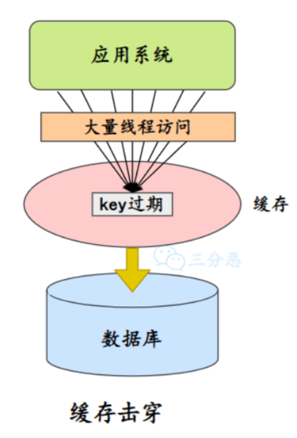

---
layout:
  title:
    visible: true
  description:
    visible: false
  tableOfContents:
    visible: true
  outline:
    visible: true
  pagination:
    visible: true
---

# JavaSE

## 1、Java概述 <a href="#usercontentjava-gai-shu" id="usercontentjava-gai-shu"></a>

***

### **什么是Java**

Java是一门面向对象的编程语言，不仅吸收了C++语言的的各种优点，还摒弃了C++里面难以理解的多继承、指针等概念，因此Java语言具有功能强大和简单易用两个特征。Java语言作为静态面向对象语言的优秀代表，极好地实现了面向对象理论，允许程序员以优雅的思维方式进行复杂的编程

### **语言特点**

Java语言有很多优秀的特点，以下几点是比较突出的：

* 面向对象（封装、继承、多态）
* 平台无关性；平台无关性具体表现在，Java是“一次编写，到处运行(With Once，Run any Where)”的语言，因此采用Java语言编写的程序具有良好的可移植性，而保证这一点的正是Java的虚拟机机制；在引入虚拟机之后，Java语言在不同的平台上运行不需要重新编译
* 支持多线程；C++语言没有内置的多线程机制，因此必须条用操作系统的多线程功能来进行多线程程序设计，而Java语言却提供多线程支持
* 编译与解释并存( 简单来说，编译型语言是指编译器针对特定的操作系统将源代码一次性翻译成可被该平台执行的机器码；解释型语言是指解释器对源程序逐行解释成特定平台的机器码并立即执行 )；Java程序要经过先编译，后解释两个步骤

### **JVM、JRE和JDK区别**

* JVM：Java Virtual Machine，Java虚拟机，Java程序运行在Java虚拟机上。针对不同系统的实现不同的JVM，因此Java语言可以实现跨平台
* JRE：Java运行时环境；它是运行已编译Java程序所需的所有内容的集合，包括Java虚拟机(JVM)，Java类库，Java命令和其他的一些基础构建；但是它不能用于创建新程序
* JDK：Java Development Kit，它是功能齐全的Java SDK；它拥有JRE所拥有的一切，还有编译器(Javac)和工具(Javadoc和jdb)；它能够创建和编译程序

简单来说：JDK包含JRE，JRE包含JVM

<figure><figcaption><p>JDK</p></figcaption></figure>

### **跨平台性**

所谓跨平台性，是指Java语言编写的程序，一次编译后，可以在多个系统平台上运行

实现原理：Java程序是通过Java虚拟机在系统平台上运行的，只要该系统可以安装相应的Java虚拟机，该系统就可以运行Java程序

### **字节码**

所谓字节码，就是Java程序经过编译之后产生的.class文件，字节码能够被虚拟机识别，从而实现Java程序的跨平台性

Java程序从源代码到运行主要有三步：

* 编译：将代码(.java)编译成虚拟机可以识别理解的字节码(.class)
* 解释：虚拟机执行Java字节码，将字节码翻译成机器能识别的机器码
* 执行：对应的机器执行二进制机器码

<figure><figcaption><p>Java源码运行步骤</p></figcaption></figure>

只需要把Java程序编译成Java虚拟机能识别的Java字节码，不同的平台安装对应的Java虚拟机，这样就可以实现Java语言的平台无关性

### **编译与解释并存**

高级编程语言按照程序的执行方式分为编译型和解释型两种

简单来说，编译型语言是指编译器针对特定的操作系统将源代码一次性翻译成可被平台执行的机器码；解释型语言是指解释器对源程序逐行解释成特定平台的机器码并立即执行

比如，你想读一本国外的小说，你可以找一个翻译人员帮你翻译，有两种选择方式，你可以先等翻译人员将全本小说(也就是源码)都翻译完，再去阅读；也可以让翻译人员翻译一段，你在旁边阅读一段，慢慢把书读完

Java语言既具有编译型语言的特征，也具有解释型语言的特征，因为Java程序要经过先编译，后解释两个步骤，由Java编写的程序需要先经过编译步骤，生成字节码(.class)文件，这种字节码必须再进过JVM，解释成操作系统能识别的机器码，在由操作系统执行；因此，可以认为Java语言编译与解释并存

<figure><figcaption><p>编译与解释并存</p></figcaption></figure>

***

## 2、基础语法 <a href="#usercontent-ji-chu-yu-fa" id="usercontent-ji-chu-yu-fa"></a>

### **数据类型**

**定义**：Java语言是强类型语言，对于每一种数据都定义了明确的具体的数据类型，在内存中分配了不同大小的内存空间

Java语言数据类型分为两种：**基本数据类型**和**引用数据类型**

<figure><figcaption><p>Java数据类型</p></figcaption></figure>

基本数据类型：

* 数值型
  * 整数类型(byte、short、int、long)
  * 浮点类型(float、double)
* 字符型(char)
* 布尔型(boolean)

Java基本数据类型范围和默认值

| 基本类型      | 位数 | 字节 | 默认值     |
| --------- | -- | -- | ------- |
| `int`     | 32 | 4  | 0       |
| `short`   | 16 | 2  | 0       |
| `long`    | 64 | 8  | 0L      |
| `byte`    | 8  | 1  | 0       |
| `char`    | 16 | 2  | 'u0000' |
| `float`   | 32 | 4  | 0f      |
| `double`  | 64 | 8  | 0d      |
| `boolean` | 1  |    | false   |

引用数据类型：

* 类(class)
* 接口(interface)
* 数组(\[])

### **类型转换**

Java所有的数值型变量可以相互转换，当把一个表数范围小的数值或变量直接赋给另一个表述范围大变量时，可以进行自动类型转换；反之，需要强制类型转换

<figure><figcaption><p>自动类型转换</p></figcaption></figure>

这就好像，小杯里的水倒进大杯没问题，但大杯的水倒进小杯就不行，可能会溢出

`float f = 3.4` 对吗？

不正确，3.4是单精度数，将双精度型(double)复制给浮点型(float)属于向下转型(down-casting，也称为窄化)造成精度损失，因此需要强制类型转换`float f = (float)3.4` 或者写成`float f = 3.4F`

`short s1 = 1; s1 = s1+1;` 对吗？ `short s1 = 1; s1 += 1` 对吗？

对于short s1 = 1; s1 = s1 + 1;编译出错，由于1是int类型，因此s1+1运算结果也是int类型，需要强制转换类型才能赋值给short型

而short s1 =1; s1+=1;可以正确编译，因为s1+=1；相当于 s1 = (short) ( s1 + 1 );其中有隐含的强制类型转换

### **自动装箱、拆箱**

* **装箱**：将基本类型用它们对应的引用类型包装起来
* **拆箱**：将包装类型转换为基本数据类型

Java 可以自动对基本数据类型和它们的包装类进行装箱和拆箱

<figure><figcaption><p>自动拆箱装箱</p></figcaption></figure>

```java
Integer i = 10;
int n = i;
```

### **&和&&区别？**

&运算符有两种用法：短路与、逻辑与

&&运算符是短路与运算，逻辑与跟短路与的差别是非常巨大的，虽然二者都要求运算符左右两端的布尔值都是true整个表达式的值才是true

&&之所以称为短路运输是因为，如果&&左边的表达式的值是false，右边的表达式会被直接短路掉，不会进行运算；很多时候可能都要用&&而不是&

例如在验证用户登录时判定用户名不是null而且不是空字符串，应当写为username!=null&&!username.equals("")，二者顺序不能交换，更不能用&运算符，因为第一个条件如果不成立，根本不能进行字符串的equals比较，否则会产生NullPointterException异常

注意：逻辑或运算符(|)和短路或(||)的差别也是如此

### **Switch参数**

Java5以前Switch(expr)中，expr只能是byte、short、char、int

从Java5开始，Java中引入了枚举类型，expr也可以是enum类型

从Java7开始，expr还可以是字符串(String)，但是长整型(long)在目前所有的版本中都还是不可以的

### **Break、Continue、Return的区别及作用**

* break：跳出整个循环，不在执行循环(结束当前的循环体)
* continue：跳出本次循环，继续执行下次循环(结束正在执行的循环 进入下一个循环条件)
* return：程序返回，不在执行下面的代码(结束当前的方法 直接返回)

<figure><figcaption><p>区别</p></figcaption></figure>

### **用最有效率的方法计算2乘以8**

**位运算**：2<<3，数字的二进制位左移三位相当于乘以2的三次方

### **自增自减运算**

在写代码的过程中，常见的一种情况是需要某个证书类型变量曾加1或减少1，Java提供了一种特殊运算符，用于这种表达式，叫做自增运算符(++)和自减运算符(--)

\++和--运算符可以放在变量之前，也可以放在变量之后

当运算符放在变量之前时(前缀)，先自增\减，再赋值；当运算符放在变量之后时(后缀)，先赋值，再自增\减

例如：当`b=++a`时，先自增(自己增加1)，再赋值(赋值给b)；当`b=a++`时，先赋值(赋值给b)，在自增(自己增加1)。也就是，++a输出的是a+1的值，a++输出的是a值

一句话就是：“符号在前就先加减，符号在后就后加减”

看下这段代码运行结果

```java
int i = 1;
i = i++;
System.out.println(i);
```

答案是 1；有点离谱对不对。

对于 JVM 而言，它对自增运算的处理，是会先定义一个临时变量来接收 i 的值，然后进行自增运算，最后又将临时变量赋给了值为 2 的 i，所以最后的结果为 1。

相当于这样的代码

```java
int i = 1；
int temp = i;
i++；
i = temp;
System.out.println(i);
```

这段代码会输出什么？

```java
int count = 0;
for(int i = 0;i < 100;i++){
    count = count++;
}
System.out.println("count = "+count);
```

答案是 0；

和上面的题目一样的道理，同样是用了临时变量，count 实际是等于临时变量的值。

```java
int autoAdd(int count){
    int temp = count;
    count = coutn + 1;
    return temp;
}
```

***

## 3、面向对象 <a href="#usercontent-mian-xiang-dui-xiang" id="usercontent-mian-xiang-dui-xiang"></a>

### **面向对象和面向过程的区别**

* 面向过程：面向过程就是分析出解决问题所需要的步骤，然后用函数把这些步骤一步步实现，使用的时候一个个的调用就可以
* 面向对象：面向对象，把构成问题的事务分解成各个对象，而建立对象的母的也不是为了完成一个个步骤，而是为了描述某个事件在解决整个问题的过程所发生的行为，目的是为了写出通用的代码，加强代码的复用，屏蔽差异性

用一个比喻：面向过程是编年体；面向对象是纪传体

<figure><figcaption><p>面向对象面向过程</p></figcaption></figure>

### **面向对象特征**

<figure><figcaption><p>三大特征</p></figcaption></figure>

* 封装
  * 封装把一个对象的属性私有化，同时提供一些可以被外界访问的属性的方法
* 继承
  * 继承是使用已存在的累的定义作为基础创建新的类，新类的定义可以增加新的属性或新的方法，也可以继承父类的属性和方法；通过继承可以很方便地进行代码复用
  * 关于继承有以下三个要点
    * 子类拥有父类对象所有的属性和方法(包括私有属性和私有方法)，但是父类中的私有属性和方法子类是无法访问，只是拥有
    * 子类可以拥有自己属性和方法，即子类可以对父类进行扩展
    * 子类可以用自己的方式实现父类的方法
* 多态
  * 所谓多态就是指程序中定义的引用变量所指向的具体类型和通过该引用变量发出的方法调用在编程时并不确定；而是在程序运行期间才确定，即一个引用变量到底会指向哪个类的实例对象，该引用变量发出的方法调用到底是哪个类中实现的方法，必须有程序运行期间才能决定
  * 在Java中两种形式可以实现多态：继承(多个子类对同一方法的重写)和接口(实现接口并覆盖接口中同一方法)

### **重载(overload)和重写(override)的区别**

方法的重载和重写都是实现多态的方式，区别在于前者实现的是编译时的多态性，而后者实现的是运行时的多态性

* 重载发生在一个类中，同名的方法如果有不同的参数列表(参数类型不同、参数个数不同或者二者都不同)则视为重载
* 重写发生在子类与父类之间，重写要求子类被重写方法与父类被重写方法有相同的返回类型，比父类被重写方法更好访问，不能比父类被重写方法声明更多的异常(里氏代换原则)

方法重载的规则：

* 方法名一致，参数列表中参数的顺序，类型，个数不同
* 重载与方法的返回值无关，存在于父类和子类，同类中
* 可以抛出不同的异常，可以有不同修饰符

### **访问修饰符区别**

Java中，可以使用访问控制符来保护对类、变量、方法和构造方法的访问；Java支持4种不同的访问权限

* **default**：默认，在同一个包内可见，不适用任何修饰符；可以修饰类、接口、变量、方法
* **private**：在同一类内可见；可以修饰变量、方法；注意：不能修饰类(外部类)
* **public**：对所有类可见；可以修饰类、接口、变量、方法
* **protected**：对同一包内的类和所有子类可见；可以修饰变量、方法；注意：不能修饰类(外部类)

<figure><figcaption><p>访问修饰符</p></figcaption></figure>

### **this关键字**

this是自身的一个对象，代表对象本身，可以理解为：指向对象本身的一个指针

this的用法在Java中大体可以分为3种：

* 普通的直接引用，this相当于指向当前对象本身
* 形参和成员变量名字重名，用this区分
* 引用本类的构造函数

### **抽象类(abstract class)和接口(interface)有什么区别**

* 接口的方法默认是public，所有方法在接口中不能有实现(Java 8开始接口方法可以有默认方法)，而抽象类可以有非抽象方法
* 接口中除了static、final变量，不能有其他变量，而抽象类中则不一定
* 一个类可以实现多个接口；但只能实现一个抽象类；接口本身可以通过extends关键字扩展多个接口
* 接口方法默认修饰符public，抽象方法可以有public、protected和default这些修饰符(抽象方法就是为了被重写所以不能使用private关键字修饰)
* 从设计层面来说，抽象是对类的抽象，是一种模板设计，而接口是对行为的抽象，是一种行为的规范
  * 在JDK8中，接口也可以定义静态方法，可以直接用接口名调用；实现类和实现是不可以调用的；如果同时实现了两个接口，接口中定义了一样的默认方法，则必须重写，不然后报错
  * JDK9的接口被允许定义私有方法

总结JDK7-9中接口的变化：

* 在JDK7或更早版本中，接口里面只能由常量变量和抽象方法；这些接口方法必须由选择实现接口的类实现
* JDK8的时候接口可以有默认方法和静态方法功能
* JDK9在接口中引用了私有方法和私有静态方法

### **成员变量与局部变量**

* 从语法形式上看：成员变量是属于类的，而局部变量是在方法中定义的变量或是方法的参数；成员变量可以被public，private，static等修饰符所修饰，而局部变量不能被访问控制修饰符及static所修饰；但是，成员变量和局部变量都能被final修饰
* 从变量在内存中的存储方式来看：如果成员变量是使用static修饰的，那么这个成员变量是属于类的，如果没有使用static修饰，这个成员变量是属于实例的；对象存于堆内存，如果局部变量类型为基本数据类型，那么存储在栈内存，如果为引用数据类型，那存放的是指向堆内存对象的引用或者是只想常量池中地址
* 从变量在内存中的生存时间上看：成员变量是对象的一部分，它随着对象的创建而存在，而局部变量随着方法的调用而自动消失
* 成员变量如果没有被赋初值：则会自动以类型的默认值而赋值(一种情况例外：被final修饰的成员变量也必须显式地赋值)，而局部变量则不会自动赋值

### **静态变量和实例变量的区别，静态方法、实例方法**

* **静态变量**：是被static修饰符修饰的变量，也称为类变量，它属于类，不属于类的任何一个对象，一个类不管创建多少个对象，静态变量在内存中有且仅有一个副本
* **实例变量**：必须依存某一实例，需要先创建对象然后通过对象才能访问到它；静态变量可以实现让多个对象共享内存
* **静态方法**：static修饰的方法，也被称为类方法；在外部调用静态方法是，使用`类名.方法名`的方式，也可以使用`对象名.方法名`的方式(IDEA编译会报错，运行不会报错，不推荐)；静态方法里不能访问类的非静态成员变量和方法
* **实例方法**：依存于类的实例，需要使用`对象名.方法名`的方式调用；可以访问类的所有成员变量和方法

### **final关键字**

final表示不可变的意思，可用于修饰类、属性和方法：

* 被final修饰的类不可以被继承
* 被final修饰的方法不可以被重写
*   被final修饰的变量不可变，被final修饰的变量必须被显式的指定初始值，还得注意的是，这里的不可变指的是变量的引用不可变，不是引用指向的内容的不可变

    ```java
    final StringBuilder sb = new StringBuilder("abc");
    sb.append("d");
    System.out.println(sb);  //abcd
    ```

<figure><figcaption><p>final变量引用不可变</p></figcaption></figure>

### **final、finally、finalize**

* final用于修饰变量、方法和类：final修饰的类不可被继承；修饰的方法不可被重写；修饰的变量不可变
* finally作为异常处理的一部分，它只能在`try/catch`语句中，并且附带一个语句块表示这段语句最终一定被执行(无论是否抛出异常)，经常被用在需要释放资源的情况下，`System.exit(0)`可以阻断finally执行
*   finalize是在`java.lang.Object`里面定义的方法，也就是说每一个对象都有这么个方法，这个方法在`gc`启动，该对象被回收的时候被调用

    一个对象的finalize方法只会被调用一次finalize被调用不一定会立即回收该对象，所以有可能调用finalize后，该对象又不需要被回收了，然后到了真正要被回收的时候，因为前面调用过一次，所以不会再次调用finalize了，进而产生问题，因此不推荐使用finalize方法

### **==和equals()**

* **==**：它的作用是判断两个对象的地址是不是相等；即判断两个对象是不是同一个对象(基本数据类型==比较的是值，引用数据类型==比较的是内存地址)
* **equals()**：它的作用也是判断两个对象是否相等；但是这个相等一般也分两种情况：
  * 默认情况：类没有覆盖equals()方法；则通过equals()比较该类的两个对象时，等价于通过`==`比较这两个对象，还是相当于比较内存地址
  * 自定义情况：类覆盖了equals()方法；一般覆盖的equals()方法是比较两个对象的内容是否相同，自定义了一个相等的标准，也就是两个对象的值是否相等
  *   举例，Person，我们认为两个人的编号和姓名相同，就是一个人：

      ```java
      public class Person {
          private String no;
          private String name;

          @Override
          public boolean equals(Object o) {
              if (this == o) return true;
              if (!(o instanceof Person)) return false;
              Person person = (Person) o;
              return Objects.equals(no, person.no) &&
                      Objects.equals(name, person.name);
          }

          @Override
          public int hashCode() {
              return Objects.hash(no, name);
          }
      }
      ```

### **hashCode()与equals()**

这个也是面试常问—"你重写过hashcode和equals么，为什么重写equals时必须要重写ha'shCode方法？"

> 什么是hashCode()?

hashCode()的作用是获取哈希码，也成为散列码；它实际上是返回一个int整数，定义在Object类中，是一个本地方法，这个方法通过用来将对象的内存地址转换为整数之后返回 `public native int hashCode()`

哈希码主要在哈希表这类集合映射的时候用到，哈希表存储的是键值对(key-value)，它的特点是：能根据`键`快速的映射到对应的`值`；这其中就利用到了哈希码

> 为什么要有hashCode()?

上面已经讲了，主要是在哈希表这种结构中用的到

例如HashMap怎么把key映射到对应value上呢？用的就是哈希取余法，也就是拿哈希码和存储元素的数组的长度取余，获取key对应value所在的下标位置

> 为什么重写equals时必须重写hashCode方法？

如果两个对象相等，则hashCode一定也是相同的；两个对象相等，对两个对象分别调用equals方法都返回true；反之，两个对象有相同的hashCode值，它们也不一定是相等的(例如“童话”，“重地”两个hashcode一样但是equals却不一样)；因此，equeals方法被覆盖过；则hashCode方法也必须被覆盖

hashCode()的默认行为是对堆上的对象产生独特值；如果没有重写hashCode()，则该class的两个对象无论如何都不会相等(即使这两个对象指向相同的数据)

> 为什么两个对象有相同的hashCode值，它们也不一定是相等的？

应为可能会**Hash碰撞**，hashCode()所使用的散列算法也许刚好会让多个对象传回相同的散列值；越糟糕的散列算法越容易碰撞，但这也与数据值域分布的特性有关（所谓碰撞也就是指不同的对象得到相同hashCode）

### **Java是值传递，还是引用传递**

Java语言是值传递；Java语言的方法调用只支持参数的值传递；当一个对象实例作为一个参数被传递到方法中时，参数的值就是对该对象的引用；对象的属性可以在被调用过程中被改变，但对对象引用的改变时不会影响到调用者的

JVM的内存分为堆和栈，其中栈中存储了基本数据类型和引用数据类型实例的地址，也就是对象地址

而对象所占的空间实在堆中开辟的，所以传递的时候可以理解为把变量存储的对象地址给传过去，因此引用类型也是值传递

<figure><figcaption><p>值传递</p></figcaption></figure>

* 值传递（pass by value）是指在调用函数时将实际参数`复制`一份传递到函数中，这样在函数中如果对`参数`进行修改，将不会影响到实际参数。
* 引用传递（pass by reference）是指在调用函数时将实际参数的地址`直接`传递到函数中，那么在函数中对`参数`所进行的修改，将影响到实际参数

参考这篇文章：[https://www.zhihu.com/question/31203609](https://gitee.com/link?target=https%3A%2F%2Fwww.zhihu.com%2Fquestion%2F31203609)

**总结**： **Java中其实还是值传递的，只不过对于对象参数，值的内容是对象的引用**

### **深拷贝和浅拷贝**

* **浅拷贝**：仅拷贝被拷贝对象的成员变量的值，也就是基本数据类型变量的值，和引用数据类型变量的地址值，而对于引用类型变量指向的堆中的对象不会拷贝
* **深拷贝**：完全拷贝一个对象，拷贝被拷贝对象的成员变量的值，堆中的对象也会拷贝一份

例如现在有一个order对象，里面有一个products列表，它的浅拷贝和深拷贝的示意图：

<figure><figcaption><p>深浅拷贝</p></figcaption></figure>

因此深拷贝是安全的，浅拷贝的话如果有引用类型，那么拷贝后对象，引用类型变量修改，会影响原对象

> 浅拷贝如何实现呢？

Object类提供的clone()方法可以非常简单的实现对象的浅拷贝

> 深拷贝如何实现呢？

* 重写克隆方法：引用类型变量单独克隆，这里可能会涉及多层递归
* 序列化：可以先将原对象序列化，再反序列化成拷贝对象

Java中有以下四种创建对象的方式：

* new 创建新对象
* 通过反射机制
* 采用clone机制
* 通过序列化机制

前两者都需要显式地调用构造方法；对于clone机制，需要注意浅拷贝和深拷贝的区别，对于序列化机制需要明确其实现原理，在Java中序列化可以通过实现Externalizable或者Serializable来实现

### **static关键字**

static是Java种非常重要的关键字，static表示的概念是静态的，在Java中，static主要用来

* 修饰变量，static修饰的变量称为静态变量、也称为类变量，类变量属于类所有，对于不同的类来说，static变量只有一份，static修饰的变量位于方法区中；static修饰的变量能够直接通过`类名.变量名`来进行访问，不用通过实例类再进行使用
* 修饰方法，static修饰的方法被称为静态方法，静态方法能够直接通过`类名.方法名`来使用，在静态方法内部不能使用非静态属性和方法
* static可以修饰代码块，主要分为两种，一种直接定义在类中，使用`static{}`，这种被称为静态代码块，一种在类中定义`静态内部类`，使用`static class xxx`来进行定义
* static可以用于静态导包，通过使用`import static xxx` 来实现，这种方式一般不推荐使用(静态导包后静态方法不需要再用类名调用，可以直接调用，就像在调用当前类的静态方法)
* static可以和单例模式一起使用，通过双重检测锁来实现线程安全的单例模式

### **初始化顺序**

首先看下有哪些需要探讨的初始化顺序

* 静态属性：static 开头定义的属性
* 静态代码块：static{} 包起来的代码块
* 普通属性：非static 定义的属性
* 普通方法块：{}包起来的代码块
* 方法：普通方法

```java
public class LifeCycle {
    // 静态属性
    private static String staticField = getStaticField();
    // 静态代码块
    static {
        System.out.println(staticField);
        System.out.println("静态代码块初始化");
    }
    // 普通属性
    private String field = getField();
    // 普通代码块
    {
        System.out.println(field);
        System.out.println("普通代码块初始化");
    }
    // 构造函数
    public LifeCycle() {
        System.out.println("构造函数初始化");
    }
    public static String getStaticField() {
        staticField = "Static Field Initial";
        System.out.println("静态属性初始化");
        return staticField;
    }
    public static String getField() {
        String field = "Field Initial";
        System.out.println("普通属性初始化");
        return field;
    }
    // 主函数
    public static void main(String[] args) {
        new LifeCycle();
    }
}
```

1. 静态属性初始化
2. 静态代码块初始化
3. 普通属性初始化
4. 普通方法初始化
5. 构造函数初始化

### **强引用、弱引用、虚引用和软引用**

不同的引用类型其实都是逻辑上的，而对于虚拟机来说，主要体现的是对象不同的`可达性(reachable)`状态和`垃圾收集(garbage collector)`的影响

通过下面的流程来对对象的生命周期做个总结：

<figure><figcaption><p>对象生命周期</p></figcaption></figure>

对象被创建并初始化，对象在运行时被使用，然后离开对象的作用域，对象会变成不可达并会被垃圾回收器回收；途中用红色表明的区域表示对象处于强可达阶段

JDK1.2介绍了`java.lang.ref`包，对象的生命周期有四个阶段：`强可达(Strongly Reachable)、软可达(Soft Reachable)、弱可达(Weak Reachable)、虚可达(Phantom Reachabel)`

<figure><figcaption><p>java.lang.ref</p></figcaption></figure>

如果只讨论符合垃圾回收条件的对象，那么只有三种：软可达、弱可达和虚可达

* **软可达**：就是只能通过软引用才能访问的状态，软可达的对象是由`SoftReference`引用的对象，并且没有强引用的对象；软引用是用来描述一些还有用但是非必须的对象；垃圾回收器会尽可能长时间的保留软引用的对象，但是会发生`OutOfMemoryError`之前，回收软引用的对象，如果回收完软引用的对象，内存还是不够分配的话，就会直接抛出内存溢出
* **弱可达**：弱可达的对象是`WeakReference`引用的对象；垃圾回收器可以随时回收弱引用的对象，不会尝试保留弱引用的对象
* **虚可达**：虚可达是由`PhantomReference`引用的对象，虚可达就是没有强、软、弱引用进行关联，并且已经被finalize过了，只有虚引用指向这个对象的时候

除此之外，还有强可达和不可达的两种判断条件

* **强可达**：就是一个对象被创建、初始化、使用中的对象都是处于强可达的状态
* **不可达(unreachable)**：处于不可达的对象就意味着对象可以被清除了

下图是一个不同可达性状态的转换图：

<figure><figcaption><p>可达性转换图</p></figcaption></figure>

判断可达性条件，也是JVM垃圾回收器决定如何处理对象的一部分考虑因素

所有的对象可达性引用都是`java.lang.ref.Reference`的子类，它里面有一个`get()`方法，返回引用对象；如果已通过程序或垃圾回收器清除了此引用对象，则此方法返回null；也就是说，除了虚引用外，软引用和弱引用都是可以得到对象的；而且这些对象可以人为`拯救`，变成强引用，例如把this关键字赋值给对象，只要重新和引用链上的任意一个对象建立关联即可

### **内部类有哪些分类，分别解释一下**

在Java中，可以将一个类的定义放在另一个类的定义内部，这就是内部类；内部类本身就是类的一个属性，与其他属性定义方式一致

内部类的分类一般主要有四种：

* **静态内部类**：定义在类内部的静态类，静态内部类可以访问外部类所有的静态变量，而不可访问外部类的非静态变量
* **成员内部类**：定义在类内部，成员位置上的非静态类，就是成员内部类；成员内部类可以访问外部类所有的变量和方法，包括静态和非静态，私有和公有的
* **局部内部类**：定义在方法中的内部类，就是举报内部类；定义在实例方法中的局部类可以访问外部类的所有变量和方法，定义在静态方法中局部类只能访问外部类的静态变量和方法
* **匿名内部类**：就是没有名字的内部类，除了没有名字，匿名内部类还有以下特点：
  * 匿名内部类必须继承一个抽象类或者实现一个接口
  * 匿名内部类不能定义任何静态成员或静态方法
  * 当所有方法的形参需要被匿名内部类使用时，必须声明为final
  * 匿名内部类不能是抽象的，它必须要实现继承的类或者实现接口的所有抽象方法

### **说出几种常用的异常**

* NullPointerException：空指针异常
* NoSuchMethodException：找不到方法异常
* ILLegalArgumentException：不合法的参数异常
* IndexOutOfBoundException：数组下标越界异常
* IOException：由于文件未找到、未打开或I/O操作不能进行而引起异常
* ClassNotFoundException：类找不到异常
* NumberFormatException：数据格式化异常
* InterruptedException：线程中断异常

### **静态绑定和动态绑定的区别**

Java程序要经过编写、编译、运行三个步骤，其中编写代码不在讨论范围之内，那么重点自然是编译和运行这两个阶段，由于编译和运行阶段过程繁琐，下面详细介绍：

Java程序从源文件创建到程序运行要经过两大步骤

* 编译时期是由编译器将源文件编译成字节码的过程
* 字节码文件有Java虚拟机解释执行

**绑定**

绑定就是一个方法的调用与调用这个方法的类连接在一起的过程被称为绑定

绑定主要分为两种：静态绑定(前期绑定、编译时绑定)和动态绑定(后期绑定、运行时绑定)

**静态绑定**

在程序运行前，也就是编译时间JVM就能够确定方法由谁调用，这种机制成为静态绑定

识别静态绑定的三个关键字以及各自的理解

如果一个方法由private、static、final任意一个关键字所修饰，那么这个方法是静态绑定的

构造方法也是静态绑定

private：是私有的意思，如果被private修饰的方法是无法被除本类之外的其他类所调用，也就是本类所特有的方法，所以也就由编译器识别此方法是属于哪个类的

```java
public class Person {
    private String talk;
    private String canTalk(){
        return talk;
    }
}

class Animal{
    public static void main(String[] args) {
        Person p = new Person();
        // private 修饰的方法是Person类独有的，所以Animal类无法访问(动物本来就不能说话)
		//p.canTalk();
    }
}
```

final：修饰的方法不能被重写，但是可以由子类进行调用，如果将方法声明为final可以有效的关闭动态绑定

```java
public class Fruit {
    private String fruitName;
    final String eatingFruit(String name){
        System.out.println("eating " + name);
        return fruitName;
    }
}

class Apple extends Fruit{
    // 不能重写final方法，eatingFruit方法只属于Fruit类，Apple类无法调用
    // String eatingFruit(String name){
    // 		super.eatingFruit(name);
    // }

    String eatingApple(String name){
        return super.eatingFruit(name);
    }
}
```

static：修饰的方法比较特殊，不用通过new出某个类调用，由`类名.方法名`直接调用该方法，这个就很关键了，new很关键，也可以认为是开启多态的导火索，而由类名.变量名直接调用的话，此时的类名是确定的，并不会产生多态

```java
public class SuperClass {
    public static void sayHello(){
        System.out.println("由 superClass 说你好");
    }
}

public class SubClass extends SuperClass{
    public static void sayHello(){
        System.out.println("由 SubClass 说你好");
    }
    
    public static void main(String[] args) {
        SuperClass.sayHello();
        SubClass.sayHello();
    }
}
```

SubClass继承SuperClass后，是无法重写sayHello方法的，也就说sayHello方法是对子类隐藏的，但是你可以编写自己的sayHello方法；由此可见，方法由static关键字所修饰，也是编译时绑定

**动态绑定**

在运行时根据具体对象的类型进行绑定

除了由private、final、static所修饰的方法和构造方法外，JVM在运行期间决定方法有哪个对象调用的过程称为动态绑定

如果把编译、运行看成一条时间线的话，在运行前必须要进行程序的编译过程，那么编译器进行的绑定就是静态绑定，在程序运行了，发生的绑定就是动态绑定

```java
public class Father {
    void drinkMilk(){
        System.out.println("父亲喜欢喝牛奶");
    }
}

public class Son extends Father{
    @Override
    void drinkMilk() {
        System.out.println("儿子喜欢喝牛奶");
    }

    public static void main(String[] args) {
        Father son = new Son();
        son.drinkMilk();
    }
}
```

Son类继承Father类，并重写了父类的dringMilk方法，在输出结果得出的是儿子喜欢和牛奶；那么上面的绑定方式是什么呢？

上面的绑定方式称之为`动态绑定`，因为在你编写Father son = new Son()的时候，编译器并不知道son对象真正引用的是谁，在程序运行时期才知道，这个son是一个Father类的对象，但是却指向Son的引用，这种概念称之为`多态`，那么就能够整理出来多态的三个原则：

* 继承
* 重写
* 父类对象指向子类引用

也就是说，在Father son = new Son()，触发了动态绑定机制

动态绑定过程

* 虚拟提提取对象的实际类型的方法表
* 虚拟机搜索方法签名
* 调用方法

**动态绑定和静态绑定的特点**

静态绑定

* 静态绑定在编译时期触发，能够提早知道代码错误
* 提高程序运行效率

动态绑定

* 使用动态绑定的前提条件能够提高代码的可用性，是代码更加灵活
* 多态是设计模式的基础，能够降低耦合性

***

## 4、String <a href="#user-content-string" id="user-content-string"></a>

### **String是Java基本数据类型吗，可以被继承吗**

> String是Java基本数据类型吗？

不是，Java中的基本数据类型只有8个：byte、short、int、long、float、double、char、boolean；除了基本类型(primitive type)，剩下的都是引用类型(reference type)

String 是一个比较特殊的引用数据类型

> String类可以继承吗？

不行，String类使用final修饰，是所谓的不可变类，无法被继承

### **String和StringBuffer、StringBuilder的区别**

* String：String的值被创建后不能修改，任何对String的修改都会引发新的String对象的生成
* StringBuffer：跟String类似，但是值可以被修改，使用synchronized来保证线程安全
* StringBuilder：是StringBuffer的非线程安全版本，性能上更高一些

### **String str1 = new String("abc")和String str2 = "abc"的区别**

两个语句都会去字符串常量池中检查是否已经存在"abc"，如果有则直接使用，如果没有则会在常量池中创建“abc"对象

<figure><figcaption><p>字符串常量池</p></figcaption></figure>

但是不同的是，String str1 = new String("abc")还会通过new String()在堆里创建一个”abc“字符串对象的实例；所以厚泽可以理解为被前者包含

> String s = new String("abc")创建了几个对象?

很明显，一个或两个；如果字符串常量池已经有”abc"，则是一个；否则，两个

当字符串常量池没有“abc”，此时会创建如下两个对象：

* 一个是字符串字面量“abc”所对应的、字符串常量池中的实例
* 另一个是通过new String()创建并初始化的，内容与“abc”相同的实例，在堆中

### **String是不可变类吗，字符串拼接式如何实现的**

String的确是不可变的，“**+**”的拼接操作，其实是会生成新的对象

例如：

```java
String a = "hello ";
String b = "world!";
String ab = a + b;
```

在JDK8之前，a和b初始化时位于字符串常量池，ab拼接后的对象位于堆中；经过拼接新生成了String对象；如果拼接多次，那么会生成多个中间对象

内存如下：

<figure><figcaption><p>字符串拼接</p></figcaption></figure>

在Java8时JDK对“**+**”号拼接进行了优化，上面所写的拼接方式会被优化为基于StringBuilder的append方法进行处理；Java会在编译期对“**+**”号进行处理

下面是通过javap -verbose命令反编译字节码的结果，很显然可以看到StringBuilder的创建和append方法的调用

```java
stack=2, locals=4, args_size=1
     0: ldc           #2                  // String hello
     2: astore_1
     3: ldc           #3                  // String world!
     5: astore_2
     6: new           #4                  // class java/lang/StringBuilder
     9: dup
    10: invokespecial #5                  // Method java/lang/StringBuilder."<init>":()V
    13: aload_1
    14: invokevirtual #6                  // Method java/lang/StringBuilder.append:(Ljava/lang/String;)Ljava/lang/StringBuilder;
    17: aload_2
    18: invokevirtual #6                  // Method java/lang/StringBuilder.append:(Ljava/lang/String;)Ljava/lang/StringBuilder;
    21: invokevirtual #7                  // Method java/lang/StringBuilder.toString:()Ljava/lang/String;
    24: astore_3
    25: return
```

也就是说其实上面的代码其实相当于：

```java
String a = "hello ";
String b = "world!";
StringBuilder sb = new StringBuilder();
sb.append(a);
sb.append(b);
String ab = sb.toString();
```

此时，如果在笼统的回答：通过加号拼接字符串会创建多个String对象，因此性能比StringBuilder差，就是错误的了；因为本质上加号拼接的效果最终经过编译器处理之后和StringBuilder是一致的

### intern方法有什么作用

JDK源码里已经对这个方法进行了说明：

```java
* <p>
* When the intern method is invoked, if the pool already contains a
* string equal to this {@code String} object as determined by
* the {@link #equals(Object)} method, then the string from the pool is
* returned. Otherwise, this {@code String} object is added to the
* pool and a reference to this {@code String} object is returned.
* <p>
```

意思是：

* 如果当前字符串内容存在于字符串常量池(即equals()方法为true，也就是内容一样)，直接返回字符串常量池中的字符串
* 否则，将此String对象添加到池中，并返回String对象的引用

### **String中equals是如何重写的**

String 代表的是Java中的字符串，String类比较特殊，它整个类都是被final修饰的，也就是说String不能被任何类继承，任何修改String字符串的方法都是创建了一个新的字符串

equals方法是Object类定义的方法，Object是所有类的父类，当然也包括String，String重写了equals方法，如下：

```java
public boolean equals(Object anObject) {
    if (this == anObject) {
        return true;
    }
    if (anObject instanceof String) {
        String anotherString = (String)anObject;
        int n = value.length;
        if (n == anotherString.value.length) {
            char v1[] = value;
            char v2[] = anotherString.value;
            int i = 0;
            while (n-- != 0) {
                if (v1[i] != v2[i])
                    return false;
                i++;
            }
            return true;
        }
    }
    return false;
}
```

* 首先会判断要比较的两个字符串它们的引用是否相等；如果引用相等的话，直接返回true，不相等的话继续下面的判断
* 然后再判断被比较的对象是否是String的实例，如果不是的话直接返回false，如果是的话，在比较两个字符串的长度是否相等，如果长度不相等的话也就没有比较的必要了；长度如果相同，会比较字符串中的每个字符是否相等，一旦有一个字符不相等，就会直接返回false

你可能有疑惑什么时候是

```java
if (this == anObject) {
  return true;
}
```

这个判断语句如何才能返回true？因为都是字符串啊，字符串比较的不都是堆空间吗，猛然一看发现好像永远也不会走，但是你忘了`String.intern()`方法，它表示的概念在不同的JDK版本有不同的区别

在JDK1.7及以后调用intern方法时判断运行时常量池中是否有指定的字符串，如果没有的话，就把字符串添加到常量池中，并返回常量池中的对象

验证过程如下：

```java
private void StringOverrideEquals(){
  String s1 = "aaa";
  String s2 = "aa" + new String("a");
  String s3 = new String("aaa");
  System.out.println(s1.intern().equals(s1));
  System.out.println(s1.intern().equals(s2));
  System.out.println(s3.intern().equals(s1));
}
```

* 首先s1.intern.equals(s1)这个无论如何都返回true，因为s1字符串创建出来就已经在常量池中存在了
* 然后第二条语句返回false，因为s1返回的是常量池中的对象，而s2返回的是堆中的对象
* 第三条语句s3.intern.equals(s1)，返回true，因为s3对象虽然在堆中创建了一个对象，但是s3中的“aaa”返回的是常量池中的对象

<figure><figcaption><p>结果</p></figcaption></figure>

***

## 5、Integer <a href="#user-content-integer" id="user-content-integer"></a>

### **Integer a = 127，Integer b = 127；Integer c = 128，Integer d = 128;相等吗**

答案是a和b相等，c和d不相等

* 对于基本数据类型==比较的值
* 对于引用数据类型==比较的是地址

Integer a = 127 这种赋值，使用到了Integer自动装箱的机制；自动装箱的时候回去缓冲池里取Integer对象，没有取到才会创建新的对象

如果整型字面量的值在-128到127之间，那么自动装箱时不会new新的Integer对象，而是直接引用缓冲池中的Integer对象，超过范围a1=b1的结果是false

```java
public static void main(String[] args) {
    Integer a = 127;
    Integer b = 127;
    Integer b1 = new Integer(127);
    System.out.println(a == b); //true
    System.out.println(b==b1);  //false

    Integer c = 128;
    Integer d = 128;
    System.out.println(c == d);  //false
}
```

> 什么是Integer缓存？

因为根据实践发现大部分的数据操作都集中在值比较小的范围，因此Integer搞了个缓冲池。默认范围是-128到127，可以根据通过设置`JVM-xx:AutoBoxCacheMax=`来修改缓存的最大值，最小值改不了

实现的原理是int在自动装箱的时候会调用Integer.valueOf，进而用到了IntegerCache

<figure><figcaption><p>IntegerValueOf</p></figcaption></figure>

很简单，就是判断下值是否在缓存范围之内，如果是的话去IntegerCache中取，不是的话就创建一个新的Integer对象

IntegerCache是一个静态内部类，在静态代码块中会初始化好缓存值

```java
private static class IntegerCache {
     ……
     static {
            //创建Integer对象存储
            for(int k = 0; k < cache.length; k++)
                cache[k] = new Integer(j++);
         ……
     }
 }
```

### **String转Integer的原理**

String转成Integer，主要有两个方法：

* Integer.parseInt(String s)
* Integer.valueOf(String s)

不管是哪一种，最终还是调用Integer类内中的`parseInt(String s，int radix)`方法

抛去一些边界之类的核心代码：

```java
public static int parseInt(String s, int radix) throws NumberFormatException{
    int result = 0;
    //是否是负数
    boolean negative = false;
    //char字符数组下标和长度
    int i = 0, len = s.length();
    ……
    int digit;
    //判断字符长度是否大于0，否则抛出异常
    if (len > 0) {
        ……
            while (i < len) {
                // Accumulating negatively avoids surprises near MAX_VALUE
                //返回指定基数中字符表示的数值。（此处是十进制数值）
                digit = Character.digit(s.charAt(i++),radix);
                //进制位乘以数值
                result *= radix;
                result -= digit;
            }
    }
    //根据上面得到的是否负数，返回相应的值
    return negative ? result : -result;
}
```

去掉枝枝蔓蔓(当然这些枝枝蔓蔓 可以去看看，源码cover了很多情况)，其实剩下的就是一个简单的字符串遍历计算，不过计算方式有点反常规，是用负的值累减

<figure><figcaption><p>parseInt方法原理</p></figcaption></figure>

***

## 6、Object <a href="#user-content-object" id="user-content-object"></a>

### **Object类的常见方法**

Object类是一个特殊的类，是所有类的父类，也就是说所有类都可以调用它的方法；它主要提供了一下11个方法，大概可以分为六类：

<figure><figcaption><p>Object</p></figcaption></figure>

**对象比较**

* `public native int hashCode()`：native方法，用于返回对象的哈希码，主要使用在哈希表中，比如JDK中HashMap
* `public boolean equals(Object obj)`：用于比较两个对象的内存地址是否相等，String对该方法进行了重写用户比较字符串的值是否相等

**对象拷贝**

* `protected native Object clone() throws CloneNotSupportedExceotion`：native方法，用于创建并返回当前对象的一份拷贝；一般情况下，对于任何对象x，表达式`x.clone!=x`为true，`x.clone().getClass==x.getClass()`为true；Object本身没有实现Cloneable接口，所以不重写clone方法并且进行调用的话会发生`CloneNotSupportedException`异常

**对象转字符串**

* `public String toString()`：返回类的名字@实例的哈希码的16进制的字符串；建议Object所有的子类都重写这个方法

**多线程调用**

* `public final native void notify()`：native方法，并且不能重写；唤醒一个在此对象监视器上等待的线程(监视器相当于就是锁的概念)；如果有多个线程在等待只会任意唤醒一个
* `public final native void notifyAll()`：native方法，并且不能重写；跟notify一样，唯一的区别就是会唤醒在此对象监视器上等待的所有线程，而不是一个线程
* `public final native void wait(long timeout) throws InterruptedException`：native方法，并且不能重写；暂停线程的执行；注意：sleep方法没有释放锁，而是wait方法释放了锁；timeout是等待时间
* `public final void wait(long timeout,int nanos) throws InterruptedException`：多了nanos参数，这个参数表示额外时间(以毫秒为单位，范围是0-999999)；所以超时的时间还需要加上nanos毫秒
* `public final void wait() throws InterruptedException`：跟之前的两个wait方法一样，只不过该方法一直等待，没有超时时间这个概念

**反射**

* `public final native Class<?> getClass()`：native方法，用于返回当前运行时对象的Class对象，使用了final关键字修饰，故不允许子类重写

**垃圾回收**

* `protected void finalize() throws Throwable`：通知垃圾收集器回收对象

***

## 7、异常处理 <a href="#usercontent-yi-chang-chu-li" id="usercontent-yi-chang-chu-li"></a>

### **Java中异常处理体系**

Java的异常体系是分为多层的

<figure><figcaption><p>异常体系</p></figcaption></figure>

Throwable是Java语言中所有错误或异常的基类；Throwable又分为Error和Exception，其中Error是系统内部错误，须虚拟机处理，是程序无法处理的；

Exception是程序问题导致的异常，又分为两种：

* CheckedException 受检异常：编译器会强制检查并要求处理的异常
* RuntimeException 运行时异常：程序运行中出现异常，比如空指针、数组下标越界等

### **异常的处理方式**

针对异常的处理主要有两种方式：

<figure><figcaption><p>异常处理方式</p></figcaption></figure>

*   遇到异常不进行具体处理，二十继续抛给调用者(throw，throws)

    抛出异常有三种形式，throw，throws，还有一种系统自动抛异常

    throws用在方法上，后面跟的是异常类，可以跟多个；而throw用在方法内，后面跟的是异常对象
*   try catch 捕捉异常

    ```java
    try {
        //包含可能会出现异常的代码以及声明异常的方法
    }catch(Exception e) {
        //捕获异常并进行处理
    }finally {
        //可选，必执行的代码
    }
    ```

    try-catch捕获异常的时候还可以选择加上finally语句块，finally语句块不管程序是否正常执行，最终它都会必然执行

### **三道经典异常处理代码题**

> 题目一

```java
public class TryDemo {
    public static void main(String[] args) {
        System.out.println(test());
    }
    public static int test() {
        try {
            return 1;
        } catch (Exception e) {
            return 2;
        } finally {
            System.out.print("3");
        }
    }
}
```

执行结果：31

try、catch、finally的基础用法，在return前会先执行finally语句块，所以是先输出finally里的3，再输出return的1

> 题目二

```java
public class TryDemo {
    public static void main(String[] args) {
        System.out.println(test1());
    }
    public static int test1() {
        try {
            return 2;
        } finally {
            return 3;
        }
    }
}
```

执行结果：3

try返回前先执行finally，结果finally里不按套路出牌，直接return了，自然也就走不到try里面的return了

finally里面使用return仅存在于面试题中，实际开发中这么些要挨吊的

> 题目三

```java
public class TryDemo {
    public static void main(String[] args) {
        System.out.println(test2());
    }
    public static int test2() {
        int i = 0;
        try {
            i = 2;
            return i;
        } finally {
            i = 3;
        }
    }
}
```

执行结果：2

可能会以为结果应该是3，因为在return前会执行finally，而i在finally中修改为3了，那最终返回i不应该为3吗？

但其实，在执行finally之前，JVM会先把i的结果暂存起来，然后finally执行完毕后，会返回之前暂存的结果，而不是返回i，所以即使i已经被修改为3，最终返回的还是之前被暂存起来的结果2

***

## 8、I/O <a href="#user-content-io" id="user-content-io"></a>

### **Java中IO流分为几种**

流按照不同的特点，有很多种划分方式

* 按照流的流向分，可以分为**输入流**和**输出流**
* 按照操作单元划分，可以划分为**字节流**和**字符流**
* 按照流的角色划分，可以划分为**节点流**和**处理流**

Java IO流共涉及40多个子类，看上去杂乱，其实都存在一定的关联，Java IO流的40多个类都是从如下4个抽象类基类中派生出来的

* **InputStream/Reader**：所有的输入流的基类，前者是字节输入流，后者是字符输入流
* **OutputStream/Writer**：所有输出流的基类，前者是字节输出流，后者是字符输出流

<figure><figcaption><p>JavaIO</p></figcaption></figure>

<figure><figcaption><p>JavaIO</p></figcaption></figure>

> IO流用到了什么设计模式？

其实，Java的IO流体系用到了一个设计模式—**装饰器模式**

InputStream相关的部分类图如下，篇幅有限，装饰器模式就不展开说了

<figure><figcaption><p>InputStream</p></figcaption></figure>

### **既然有了字节流，为什么还要有字符流**

其实字符流是由Java虚拟机将字节转换的得到的，问题就出在这个过程比较耗时，并且，如果不知道编码类型就很容易出现乱码问题

所以，I/O流就干脆提供了一个直接操作字符的接口，方便对字符进行流操作；如果音频文件、图片等媒体文件用字节流比较好，如果涉及到字符的话使用字符流比较好

### **BIO、NIO、AIO**

<figure><figcaption><p>三种IO</p></figcaption></figure>

**BIO(blocking I/O)**：就是传统的IO，**同步阻塞**，服务器实现模式为一个连接一个线程，**即客户端有连接请求时服务器端就需要启动一个线程进行处理**，如果这个连接不做任何事情会造成不必要的线程开销，可以通过连接池机制改善(实现多个客户链接服务器)

<figure><figcaption><p>BIO</p></figcaption></figure>

BIO方式适用于连接数目比较小且固定的架构，这种方式对服务器资源要求比较高，并发局限于应用中，JDK1.4以前的唯一选择，程序简单易理解

**NIO(java non-blocking I/O)**：是指JDK提供的新API，从JDK1.4开始，Java提供了一系列改进的输入/输出的新特性，被统称为NIO(即New IO)

NIO是**同步非阻塞**的，服务器端用一个线程处理多个连接，客户端发送的连接请求会注册到多路复用器上，多路复用器轮询到连接，有IO请求就进行处理

<figure><figcaption><p>NIO</p></figcaption></figure>

NIO的数据是面向**缓冲区Buffer**的，必须从Buffer中读取或写入

所以完整的NIO示意图：

<figure><figcaption><p>NIO</p></figcaption></figure>

可以看出，NIO的运行机制：

* 每个Channel对应一个Buffer
* Selector对应一个线程，一个线程对应多个Channel
* Selector会根据不同的事件，在各个通道上切换
* Buffer是内存块，底层是数据

**AIO(asynchronous I/O)**：JDK7引入了AIO，是**异步非阻塞**的IO；进行IO编程中，常用到两种模式：Reactor和Proactor；Java得NIO就是Reactor，当有事件触发时，服务端得到通知，进行相应的处理，完成后才通知服务端程序启动线程去处理，一般适用于连接数较多且连接时间较长的应用

***

## 9、序列化 <a href="#usercontent-xu-lie-hua" id="usercontent-xu-lie-hua"></a>

### **序列化，反序列化**

什么是序列化，序列化就是把Java对象转成二进制流，方便存储和传输

所以反序列化就是把二进制流恢复成对象

<figure><figcaption><p>序列化</p></figcaption></figure>

类比生活中一些大件物品的运输，运输的时候把它拆了打包，用的时候再拆包组装

> Serializable 接口有什么用？

这个接口只是标记，没有具体的作用，但是如果不实现这个接口，在有些序列化场景会报错，所以一般建议，创建的JaveBean类都实现Serializable

> serialVersionUID 又有什么用？

serialVersionUID 就是起验证作用

`private static final long serialVersionUID = 1l`

经常会看到这样的代码，这个ID其实就是用来验证序列化的对象和反序列化对应的对象ID是否一致

这个ID的数字其实不重要，无论是1L还是IDE自动生成的，子要序列化时候对象的serialVersionUID和反序列化时候对象的serialVersionUID一致的话就行

如果没有显式指定serialVersionUID，则编译器会根据类的相关信息自动生成一个，可以认为是一个指纹

所以如果你没有定义一个serialVersionUID，结果序列化一个对象之后，在反序列化之前把对象的类的结构改了，必须增加了一个成员变量，则此时的反序列化会失败

因为类的结构变了，所以serialVersionUID就不一致

> Java序列话不包含静态变量？

序列化的时候是不包含静态变量的

> 如果有些变量不想被序列化，怎么办？

对于不想进行序列化的变量，使用`transient`关键字修饰

`transient`关键字的作用是：阻止实例中那些用此关键字修饰的变量序列化；当对象被反序列化时，被`transient`修饰的变量值不会被持久化和恢复；`transient`只能修饰变量，不能修饰类和方法

### **序列化方式**

Java序列化方式有很多，常见的有三种：

<figure><figcaption><p>常见序列化方式</p></figcaption></figure>

* **Java对象序列化**：Java原生序列化方法即通过Java原生流(InputStream和OutputStream之间的转化)的方式进行，一般是对象输出流`ObjectOutputStream`和对象输入流`ObjectInputStream`
* **Json序列化**：这个可能是最常见的序列化方式，Json序列化的选择很多，一般会使用Jackson包，通过ObjectMapper类来进行一些操作，比如将对象转化为byte数组或则将Json串转化为对象
* **ProtoBuff序列化**：ProtocolBuffer是一种轻便高效的结构化数据存储格式，ProtoBuff序列化对象可以很大程度上压缩，可以大大减少数据传输大小，提高系统性能

***

## 10、泛型 <a href="#usercontent-fan-xing" id="usercontent-fan-xing"></a>

### **Java泛型，什么是类型擦除，常用的通配符**

> 什么是泛型?

Java 泛型(generics)是JDK5中引用的新特性，泛型提供了编译时类型安全检测机制，该机在允许程序员在编译时检测到非法的类型；泛型的本质是参数化类型，也就是说所操作的数据类型被指定为一个参数

```java
List<Integer> list = new ArrayList<>();

list.add(12);
//这里直接添加会报错
list.add("a");
Class<? extends List> clazz = list.getClass();
Method add = clazz.getDeclaredMethod("add", Object.class);
//但是通过反射添加，是可以的
add.invoke(list, "kl");

System.out.println(list);
```

泛型一般有三种使用方式：**泛型类、泛型接口、泛型方法**

<figure><figcaption><p>泛型</p></figcaption></figure>

**泛型类**

```java
//此处T可以随便写为任意标识，常见的如T、E、K、V等形式的参数常用于表示泛型
//在实例化泛型类时，必须指定T的具体类型
public class Generic<T>{

    private T key;

    public Generic(T key) {
        this.key = key;
    }

    public T getKey(){
        return key;
    }
}
```

如何实例化泛型类：

`Generic<Integer> genericInteger = new Generic<Integer>(123456);`

**泛型接口**

```java
public interface Generator<T> {
    public T method();
}
```

实现泛型接口，指定类型：

```java
class GeneratorImpl implements Generator<String>{
    @Override
    public String method() {
        return "hello";
    }
}
```

**泛型方法**

```java
 public static < E > void printArray( E[] inputArray ){
     for (E element : inputArray ){
         System.out.printf( "%s ", element);
     }
     System.out.println();
 }
```

使用：

```java
// 创建不同类型数组： Integer, Double 和 Character
Integer[] intArray = { 1, 2, 3 };
String[] stringArray = { "Hello", "World" };
printArray(intArray);
printArray(stringArray);
```

> 反省常用的通配符有哪些？

**常用的通配符为：T，E，K，V，？**

* ？ 表示不确定的Java类型
* T(type) 表示具体的一个Java类型
* K V (key value) 分别代表Java键值中Key Value
* E (element) 代表 Element

> 什么是泛型擦除？

所谓的泛型擦除，官方名叫“**类型擦除**”

Java的泛型是伪泛型，这是因为Java在编译期间，所有的类信息都会被擦掉

也就是说，在运行的时候是没有泛型的

例如这段代码，往一群猫里面放条狗

```java
LinkedList<Cat> cats = new LinkedList<Cat>();
// 注意我在这里把范型去掉了，但是list和cats是同一个链表！
LinkedList list = cats;  
// 完全没问题！
list.add(new Dog());  
```

因为Java的泛型只存在于源码里，编译的时候给你静态的检查一下泛型类型是否正确，而到了运行时就不检查了；上面这段代码在JRE(Java运行环境)看来和下面这段没区别

```java
// 注意：没有范型！
LinkedList cats = new LinkedList();  
LinkedList list = cats;
list.add(new Dog());
```

> 为什么要类型擦除呢？

主要是为了向下兼容，因为JDK5之前是没有泛型的，为了让JVM保持向下兼容，就出来类型擦除这个策略

***

## 11、注解 <a href="#usercontent-zhu-jie" id="usercontent-zhu-jie"></a>

### **对注解的理解**

Java注解本质上是一个标记，可以理解成生活中的一个人的一些小装扮，比如带什么帽子，戴什么眼睛

注解可以标记在类上、方法上、属性上等，标记自身也可以设置一些值，比如帽子颜色是绿色的等

有了标记之后，就可以在编译或者运行阶段去识别这些标记，然后搞一些事情，这就是注解的用处

例如常见的AOP，使用注解作为切点就是运行期注解的应用；比如lombok，就是注解在编译器的运行

注解生命周期有三大类，分别是：

* RetentionPolicy_._SOURCE：给编译器用的，不会写入class文件
* RetentionPolicy.CLASS：会写入class文件，在类加载阶段丢失，也就是运行的时候就没这个信息了
* RetentionPolicy.RUNTIME：会写入class文件，永久保存，可以通过反射获取注解信息

不同的是那么周期的解析动作是不同的，像常见的：

<figure><figcaption><p>Override</p></figcaption></figure>

就是给编译器用的，编译器编译的时候检查没问题就over了，class文件里面不会有Override这个标记

再比如Spring常见的Autowired，就是RUNTIME的，所以在运行的时候可以通过反射得到注解的信息，还能拿到标记的值required

<figure><figcaption><p>Autowired</p></figcaption></figure>

***

## 12、反射 <a href="#usercontent-fan-she" id="usercontent-fan-she"></a>

### **什么是反射，应用，原理**

> 什么是反射？

通常都是利用`new`方式来创建对象实例，这可以说就是一种“正射”，这种方式在编译时就确定了类型信息

而如果想在运行的时候动态地获取类信息、创建类实例、调用类方法这时候就要用到反射

反射最核心的四个类：

<figure><figcaption><p>反射核心</p></figcaption></figure>

> 反射的应用场景？

一般平时都是在写业务代码，很少会接触到直接使用反射机制的场景

但是，这并不代表反射没有用；相反，正是因为反射，才能这么轻松地使用各种框架；像Spring/SpringBoot、MyBatis等等框架中大量使用了反射机制

像Spring里的很多注解，它真正的功能实现就是利用反射

就像为什么使用Spring的时候，一个@Component注解就声明了一个类为SpringBean呢？为什么通过一个@Value注解就读取到配置文件中的值？

这些都是因为可以基于反射操作类，然后获取到类/属性/方法/方法的参数上的注解，注解这里就有两个作用，一是标记，对注解标记的类/属性/方法进行对应的处理；二是注解本身的一些信息，可以参与到处理的逻辑中

> 反射的原理？

Java程序的执行分为编译和运行两步，编译之后会生成字节码(.class)文件，JVM进行类加载的时候，会加载字节码文件，将类型相关的所有信息加载进方法区，反射就是去获取这些信息，然后进行各种操作

### **获取反射的三种方式**

* 通过new对象实现反射机制
* 通过路径实现反射机制
* 通过类名实现反射机制

```java
public class Student {
    private int id;
    String name;
    protected boolean sex;
    public float score;
}

public class Get {
    //获取反射机制三种方式
    public static void main(String[] args) throws ClassNotFoundException {
        //方式一(通过建立对象)
        Student stu = new Student();
        Class classobj1 = stu.getClass();
        System.out.println(classobj1.getName());
        //方式二（所在通过路径-相对路径）
        Class classobj2 = Class.forName("fanshe.Student");
        System.out.println(classobj2.getName());
        //方式三（通过类名）
        Class classobj3 = Student.class;
        System.out.println(classobj3.getName());
    }
}
```

***

## 13、JDK8 <a href="#usercontentjdk18-xin-te-xing" id="usercontentjdk18-xin-te-xing"></a>

JDK 已经出到 17 了，但是你迭代你的版本，我用我的 8。JDK1.8 的一些新特性，当然现在也不新了，其实在工作中已经很常用了

### **新特性**

JDK1.8有不少新特性，经常接触到的新特性如下：

<figure><figcaption><p>JDK1.8新特性</p></figcaption></figure>

* 接口默认方法：Java8允许给接口添加一个非抽象的方法实现，只需要使用default关键字修饰即可
* Lambda表达式和函数式接口：Lambda表达式本质上是一段匿名内部类，也可以是一段可以传递的代码；Lambda允许把函数作为一个方法的参数(函数作为参数传递方法中)，使用Lambda表达式使用代码更加简洁，但是也不要滥用，否则会有可读性等问题，建议使用Lambda表达式最好不要超过3行
*   Stream API：用函数式编程方式在集合类上进行复杂操作的工具，配合Lambda表达式可以方便的对集合进行处理

    Java8 中处理集合的关键抽象概念，它可以指定你希望对集合进行和操作，可以执行非常复杂的查找、过滤和映射数据等操作；使用Stream API对集合数据进行操作，就类似于使用SQL执行的数据库查询；也可以使用Stream API来并行执行操作

    简而言之，Stream API提供了一种高效且易于使用的处理数据的方式
* 日期时间API：Java 8 引入了新的日期时间API改进了日期时间的管理
* Optional类：用来解决空指针异常的问题；很久以前GooGle Guava项目引入了Optional作为解决空指针异常的一种方式，不赞成代码被null检查的代码污染，期望程序员写整洁的代码；受GooGle Guava的鼓励，Optional现在是Java 8 库的一部分

### **Lambda表达式**

Lambda表达式本质上是一段匿名内部类，也可以是一段可以传递的代码

比如以前使用Runnable创建并运行线程：

```java
new Thread(new Runnable() {
    @Override
    public void run() {
        System.out.println("Thread is running before Java8!");
    }
}).start();
```

这是通过内部类的方式来重写run方式，使用Lambda表达式，还可以更加简洁：

`new Thread( () -> System.out.println("Thread is running since Java8!") ).start();`

当然不是每个接口都可以缩写Lambda表达式；只有那些函数式接口(Functional Interface)才能缩写成Lambda表示式

所谓函数式接口(Functional Interface)就是只包含一个抽象方法的声明；针对该接口类型的所有Lambda表达式都会与这个抽象方法匹配

> Java 8 有哪些内置函数式接口？

JDK1.8 API 包含了很多内置的函数式接口；其中就包括在老版本中经常见到的Comparator和Runnable，Java 8为它们都添加了@FunctionalInterface注解，以用来支持Lambda表达式

除了这两个之外，还有Callable、Predicate、Function、Supplier、Comsumer等等

### **Optional**

`Optional`是用于防范`NullPointerException`

可以将`Optional`看做事包装对象(可能是null，也有可能非null)的容器；当定义了一个方法，这个方法返回的对象可能是空，也有可能非空的时候，就可以考虑用`Optional`来包装它，这也是Java8被推荐使用的做法

```java
Optional<String> optional = Optional.of("bam");
optional.isPresent();           // true
optional.get();                 // "bam"
optional.orElse("fallback");    // "bam"
optional.ifPresent((s) -> System.out.println(s.charAt(0)));     // "b"
```

### **Stream**

`stream`流，简单来说，使用`java.util.Stream`对一个包含一个多多个元素的集合做各种操作；这些操作可能是中间操作或是终端操作；终端操作返回一个结果，而中间操作会返回一个`Stream`流

Stream流一般用于集合，对一个集合做几个常见操作：

```java
List<String> stringCollection = new ArrayList<>();
stringCollection.add("ddd2");
stringCollection.add("aaa2");
stringCollection.add("bbb1");
stringCollection.add("aaa1");
stringCollection.add("bbb3");
stringCollection.add("ccc");
stringCollection.add("bbb2");
stringCollection.add("ddd1");
```

*   **Filter 过滤**

    ```java
    stringCollection
        .stream()
        .filter((s) -> s.startsWith("a"))
        .forEach(System.out::println);

    // "aaa2", "aaa1"
    ```
*   **Sorted 排序**

    ```java
    stringCollection
        .stream()
        .sorted()
        .filter((s) -> s.startsWith("a"))
        .forEach(System.out::println);

    // "aaa1", "aaa2"
    ```
*   **Map 转换**

    ```java
    stringCollection
        .stream()
        .map(String::toUpperCase)
        .sorted((a, b) -> b.compareTo(a))
        .forEach(System.out::println);

    // "DDD2", "DDD1", "CCC", "BBB3", "BBB2", "AAA2", "AAA1"
    ```
*   **Match 匹配**

    ```java
    // 验证 list 中 string 是否有以 a 开头的, 匹配到第一个，即返回 true
    boolean anyStartsWithA =
        stringCollection
            .stream()
            .anyMatch((s) -> s.startsWith("a"));

    System.out.println(anyStartsWithA);      // true

    // 验证 list 中 string 是否都是以 a 开头的
    boolean allStartsWithA =
        stringCollection
            .stream()
            .allMatch((s) -> s.startsWith("a"));

    System.out.println(allStartsWithA);      // false

    // 验证 list 中 string 是否都不是以 z 开头的,
    boolean noneStartsWithZ =
        stringCollection
            .stream()
            .noneMatch((s) -> s.startsWith("z"));

    System.out.println(noneStartsWithZ);      // true
    ```
*   **Count 计数**

    ```java
    // 先对 list 中字符串开头为 b 进行过滤，让后统计数量
    long startsWithB =
        stringCollection
            .stream()
            .filter((s) -> s.startsWith("b"))
            .count();

    System.out.println(startsWithB);    // 3
    ```
*   **Reduce**

    `Reduce`中文翻译为：减少、缩小；通过入参的`Function`，能够将`list`规约成一个值；它的返回值是`Optional`类型

    ```java
    Optional<String> reduced =
        stringCollection
            .stream()
            .sorted()
            .reduce((s1, s2) -> s1 + "#" + s2);

    reduced.ifPresent(System.out::println);
    // "aaa1#aaa2#bbb1#bbb2#bbb3#ccc#ddd1#ddd2"
    ```

以上是常见的几种流式操作，还有其它的一些流式操作，可以帮助更便捷的处理集合数据

<figure><figcaption><p>流式操作</p></figcaption></figure>
